# Adore Pasta

## Table of Contents

1. [Test](#test)
    - [Validation Services](#validation-services)
        - [W3C Markup Validation Service](#w3c-markup-validation-service)
        - [W3C CSS Validation Service](#w3c-css-validation-service)
        - [JSHint](#jshint)
        - [PEP8 Online](#pep8-online)
    - [Testing User Stories](#testing-user-stories)
        - [Common Users](#common-users)
        - [Unregistered Users](#unregistered-users)
        - [Registered Users](#registered-users)
        - [Administrator Users](#administrator-users)
    - [Further Testing](#further-testing)
    - [Known Bugs](#known-bugs)
        - [Unfixed](#unfixed)

## Test

### Validation Services

#### [W3C Markup Validation Service](https://validator.w3.org/)

- All pages on the website were validated by copying the rendered HTML code from Chrome DevTools and pasting it into the validator.
- The validation tool reported no errors or warnings. 

#### [W3C CSS Validation Service](https://jigsaw.w3.org/css-validator/)

- The CSS code was validated using direct input mode.
- The validation tool reported no errors after checking the CSS code.
- A warning is displayed stating that imported stylesheets are not validated in direct input mode.

#### [JSHint](https://jshint.com/)

- JSHint did not report any errors or warnings when validating the JavaScript code.
- JSHint was configured with the following settings during validation.

    ```
    /* jshint esversion: 8 */ 
    /* globals $:false */
    ```

#### [PEP8 Online](http://pep8online.com/)

- The tool did not report any warnings or errors after validating the Python code for PEP8 compliance.

### Testing User Stories

#### Common Users

- As a user, I want the opportunity to see all existing recipes.
    - A link to the ***Recipes*** page is visible in the navigation bar.
    - All recipes can be viewed even if the user is not logged in.

    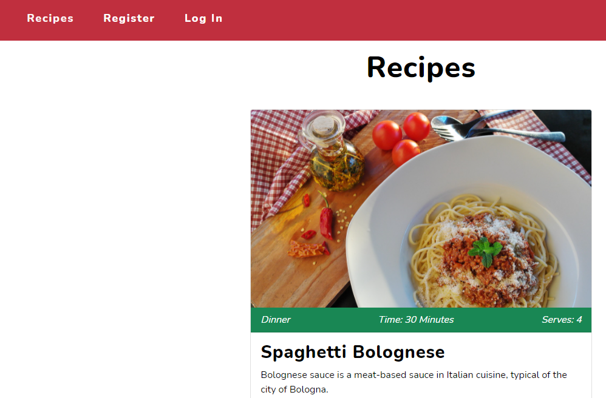

- As a user, I want to be able to search for recipes.
    - The search field is visible on all pages and can also be used by users who are not logged in.
    - An index in the database makes it possible to search by recipe name or an ingredient.

    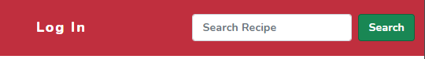

#### Unregistered Users

- As an unregistered user, I want to be able to register an account and log in.
    - Links for the register and login functionality are clearly visible in the navigation bar.

    
    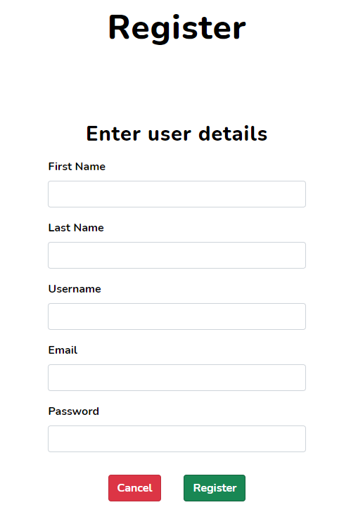
    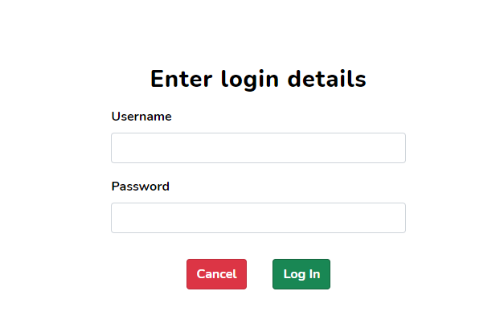

#### Registered Users

- As a registered user, I want a profile page that only shows my own recipes.
- As a registered user, I want to be able to add my own recipes.
    - The ***My Recipes*** page shows the user's own recipes.
    - A button at the top of the ***My Recipes*** page links to a form that the user can fill in to add a recipe.

    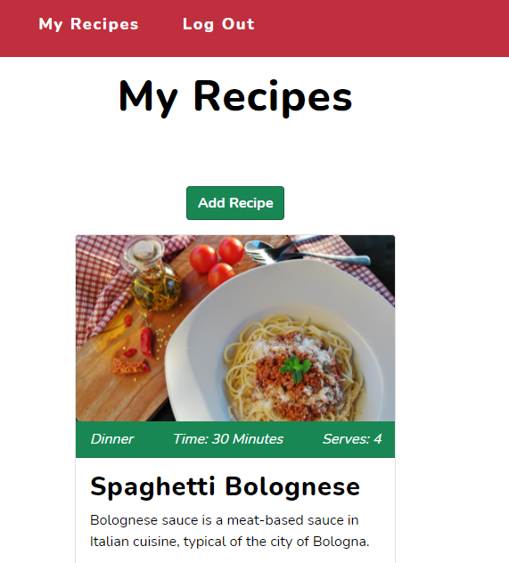
    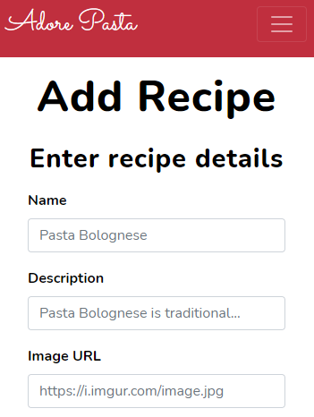

- As a registered user, I want to be able to delete my own recipes.
- As a registered user, I want to be able to update my own recipes.
    - The ***Edit*** and ***Delete*** buttons appear on each recipe card.
    - A confirmation is required from the user to delete a recipe.
    - The user can update the recipe by clicking the ***Edit*** button and filling in the desired changes.

    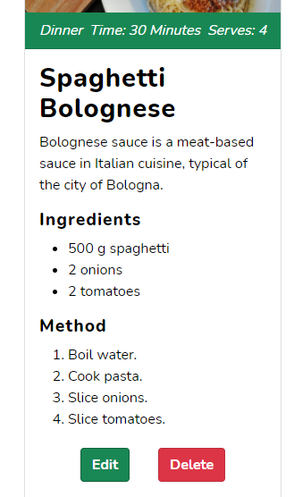
    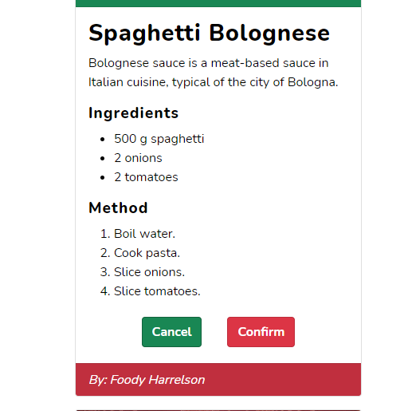
    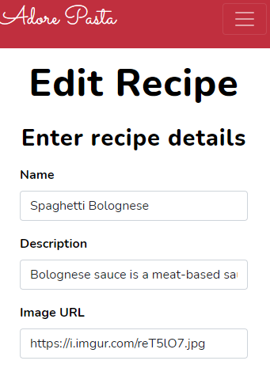

- As a registered user, I want to see statistics on the number of recipes in the database.
- As a registered user, I want to see statistics on how many registered users there are.
    - Statistics on the number of registered users and recipes can be seen at the bottom of the home page.

    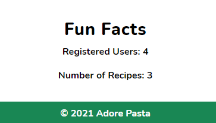

- As a registered user, I want to see statistics on the most common ingredient in the database.
    - This user story did not become a feature in the current version of the website.
    - The user story will be fulfilled in a future version.

- As a registered user, I want to be able to log out.
    - The ***Log Out*** button is easy to find in the navigation bar.

    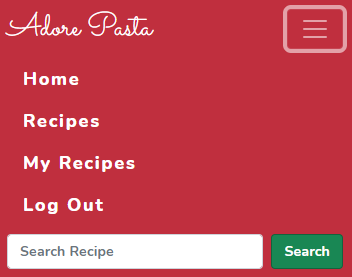

#### Administrator Users

- As an administrator user, I want to be able to edit and delete recipes that were not created by myself.
    - Administrator users have access to the ***Edit*** and ***Delete*** buttons on all recipe cards.

    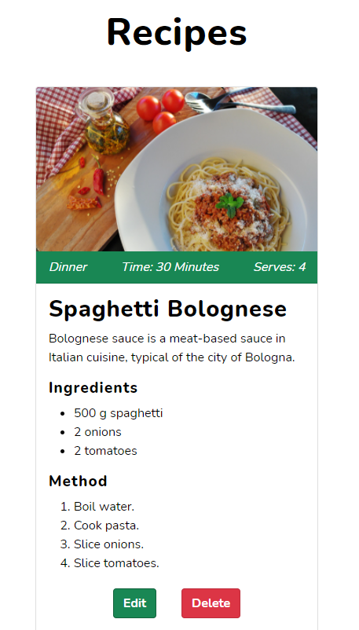

### Further Testing

- Testing of the website has been performed with Google Chrome, Microsoft Edge and Mozilla Firefox.
- With the exception of a [bug](#unfixed) that appears in Mozilla Firefox, the website behaves similarly in all of the above mentioned browsers.

### Known Bugs

#### Unfixed

- When input fields that contain numbers are focused in Firefox, the values change if you try to scroll up or down the page.

Back to main [README](README.md) file.